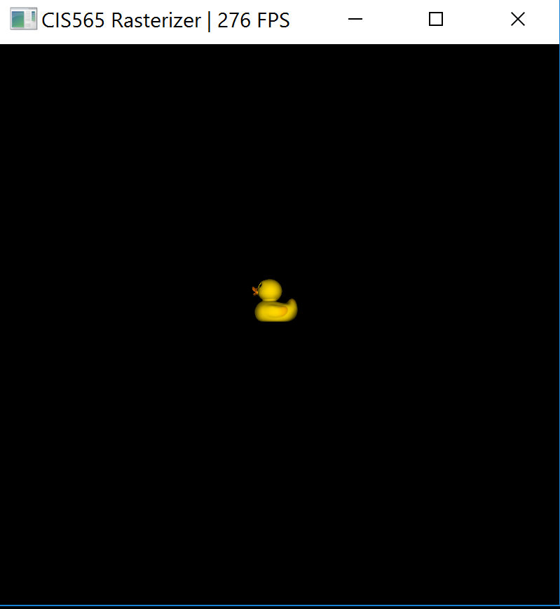
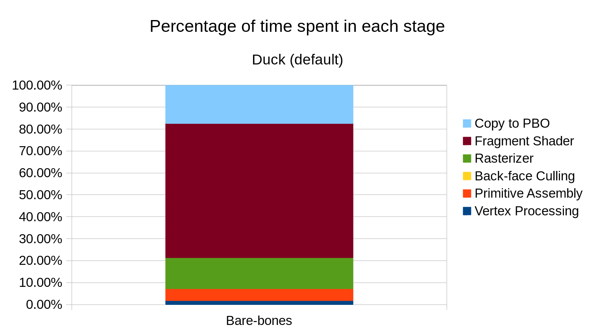
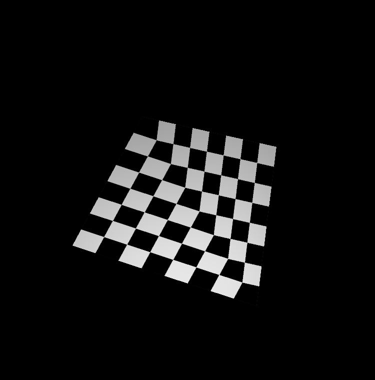
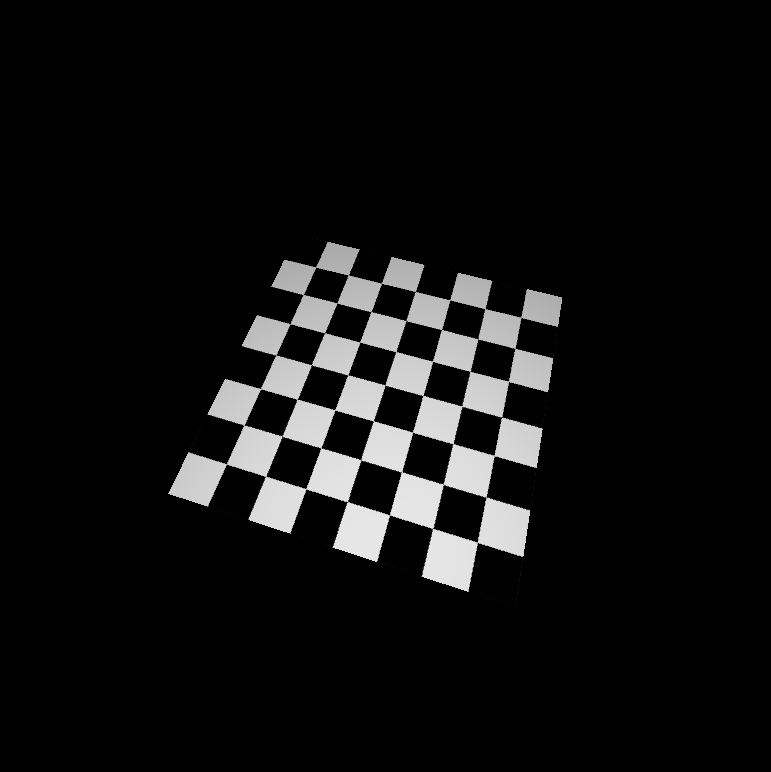
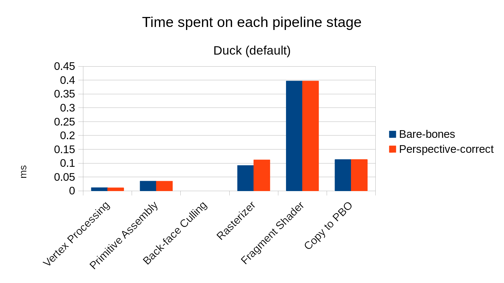
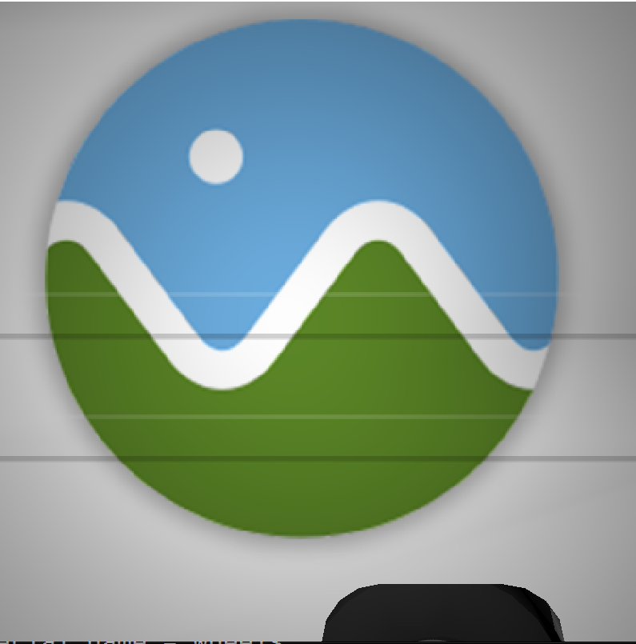

CUDA Rasterizer
===============

**University of Pennsylvania, CIS 565: GPU Programming and Architecture, Project 4**

* Mauricio Mutai
* Tested on: Windows 10, i7-7700HQ @ 2.2280GHz 16GB, GTX 1050Ti 4GB (Personal Computer)

## Overview

### Introduction

The aim of this project was to implement a simple GPU rasterizer. A rasterizer is a program that takes in 3D vertices that make up models, as well as additional data, such as surface normals and texture maps, and outputs a 2D image representing a view of the models.

The rasterization process involves repeating the same operations on different pieces of data, which makes it a good fit for a parallel program that makes use of a GPU's capabilities.

In addition, this process involves several steps that can be logically separated from one another. Thus, we can build a rasterization pipeline that connects each of the steps in order to produce the final image, while allowing us to modify each step individually.

In my implementation, these steps (or pipeline stages) are:

* Vertex Processing (transforming from 3D into projected 2D space)
* Primitive Assembly (assemble 2D vertices into pieces of geoemetry, usually triangles)
* Back-face Culling (optional -- make next stages ignore pieces of geometry that cannot be rendered due to their orientation)
* Rasterizer (generating "pixel candidates", or fragments, from the 2D data)
* Fragment Shader (coloring fragments)
* Copy to PBO (send image to be displayed)

### Features

Below are the rasterizer's main features:

* Back-face culling
* UV texture mapping with support for bilinear interpolation and perspective-correct mapping
* Supersample antialiasing
* Basic Lambert shading

## Analysis

### Scenes used for Analysis

The main scene used for this analysis was `duck.gltf`. This was rendered in two ways. One is the default view that appears when the rasterizer first loads:

The other view was obtained by zooming into the duck:

### Bare-bones performance overview

Below is a breakdown of the percentage of time spent in each stage of the pipeline for the default duck render:

As we can see, most of our time is spent on the fragment shader. This makes sense, since each triangle is small relative to the screen, so the rasterizer stage spends relatively less time generating fragments.

Below is the same breakdown, but for the zoomed-in render:

Now, the rasterizer stage takes up much more time than any of the other stages. The triangles are now larger with regards to the screen, the rasterizer spends more time iterating over all the pixels covered by the triangle and generating fragments for them.

Next, we will investigate one optimization I implemented to attempt to speed up my pipeline.

### Back-face culling

#### Overview

Back-face culling is a common optimization in rasterizers. It is based on the idea that triangles have a "correct" side -- that is, they should be visible from one side, but not the other. This information is encoded by the triangle's surface normal. If we look at the triangle such that the normal is pointing towards us, then we are looking at the visible side.

Thus, we can choose to ignore triangles if their normal is not facing us.

This was implemented using `thrust::remove_if` as a stream compaction function.

#### Performance impact

Below is a stage-wise comparison of the default duck render with back-face culling enabled and disabled:

As we would expect, the time spent in the rasterizer is decreased, since it has to process fewer triangles. However, the overhead of performing stream compaction on the list of triangles actually makes the back-face culling version slower overall! However, we can assume the cost of stream compaction will remain roughly the same even if we zoom in on the duck model. So what does the performance look like for that case?

Below is the same comparison, but for the zoomed-in duck render:

As we can see, the rasterizer performance has a huge improvement thanks to the culling stage. The cost of culling is now minimal compared to the savings we obtained in the rasterizer stage.

#### Further optimizations

Currently, the check to see if a triangle should be culled is made in the `shouldCull()` function, which is called as part of the stream compaction process. Perhaps this could be moved to the vertex processing stage or primitive assembly stage, although it probably would not create any noticeable improvements.

Unfortunately, the cost of stream compaction means back-face culling does not always improve performance. Essentially, we need to cull away triangles that would generate many fragments to make up for this cost. A faster stream compaction would certainly help to offset this cost.

### UV texture mapping -- perspective-correct interpolation

#### Overview

When projecting 3D vertices onto a 2D space, the "depth" of these vertices gets distorted. This makes it so interpolating values from these coordinates naively (e.g. using only barycentric coordinates) leads to incorrect results. For example, see the following render of `checkerboard.gltf`, which was made using this naive interpolation method:

The expected result can be seen in this render that uses the perspective-correct interpolation method:

This method basically involves computing a perspective-correct Z (or depth) value using the barycentric coordinates and the inverse of each vertex's depth values, and then multiplying each barycentric coordinate by `(perspective-correct Z) / (each vertex's Z)`.

#### Performance impact

Below is a comparison of the time spent on each pipeline stage for the default duck render, with perspective-correct enabled and disabled:

As we can see, the time spent in the rasterizer increases slightly, but not very significantly. This makes sense, since the rasterizer needs to perform additional work for each fragment in order to calculate the perspective-correct weights.

#### Further optimizations

In order to speed up computations in the rasterizer, the inverse of each vertex's Z value could be computed in the vertex processing stage.

### UV texture mapping -- bilinear filtering

#### Overview

Simply put, bilinear filtering is a way of making texture mapped models have a smoother coloring. With bilinear filtering, we perform bilinear interpolation based on the UV coordinates, such that the final sampled color is based on up to four pixels from the texture, rather than just one. This allows for a smoother transition when there is a change in color in the texture.

Below is a zoomed-in version of `CesiumMilkTruck.gltf` without bilinear filtering enabled:

Compare to the same scene, rendered with bilinear filtering enabled:

The white curve in the Cesium logo looks much smoother when bilinear filtering is turned on.

#### Performance impact

### Credits

* [tinygltfloader](https://github.com/syoyo/tinygltfloader) by [@soyoyo](https://github.com/syoyo)
* [glTF Sample Models](https://github.com/KhronosGroup/glTF/blob/master/sampleModels/README.md)
